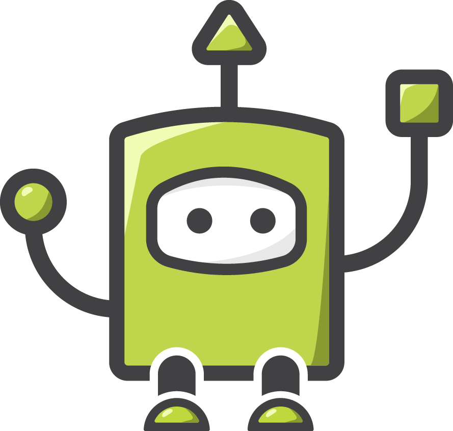
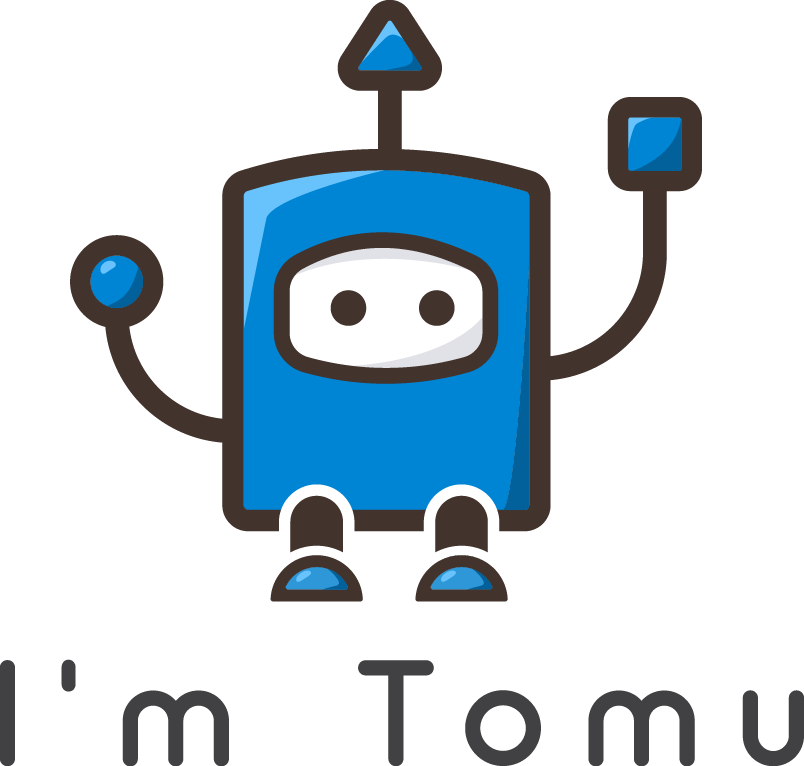
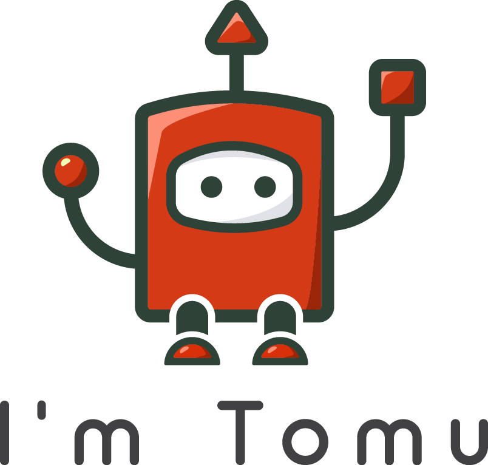
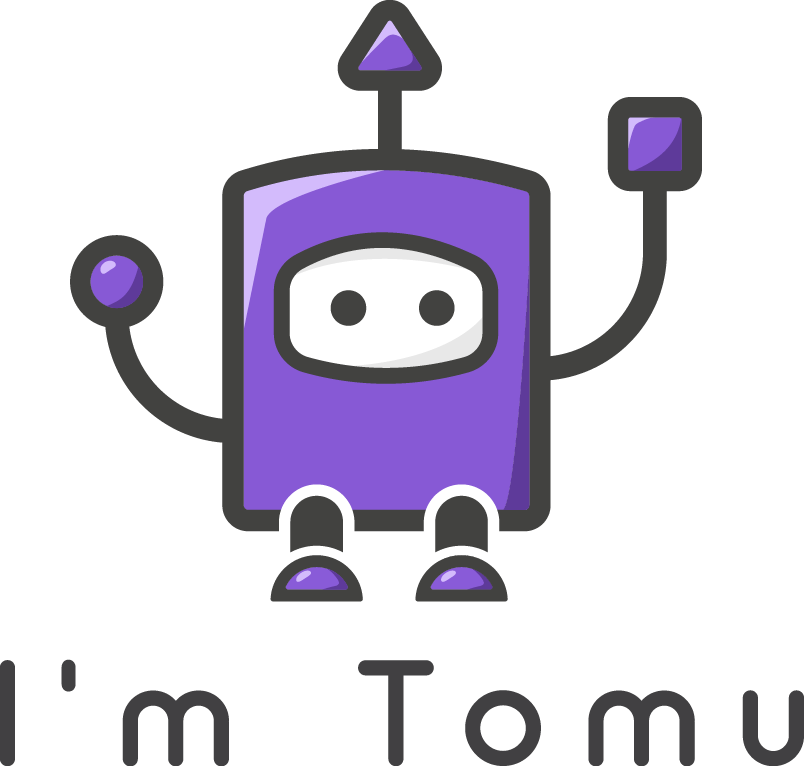
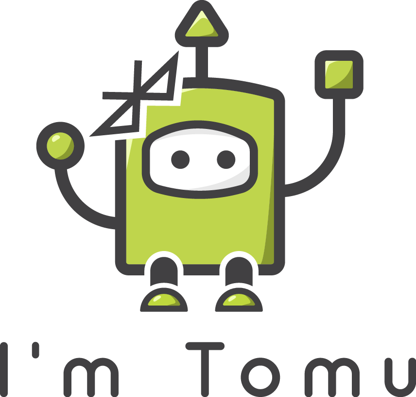
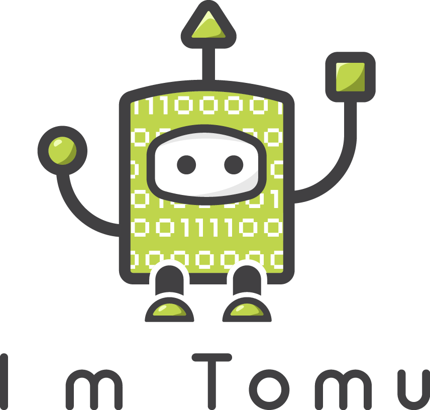
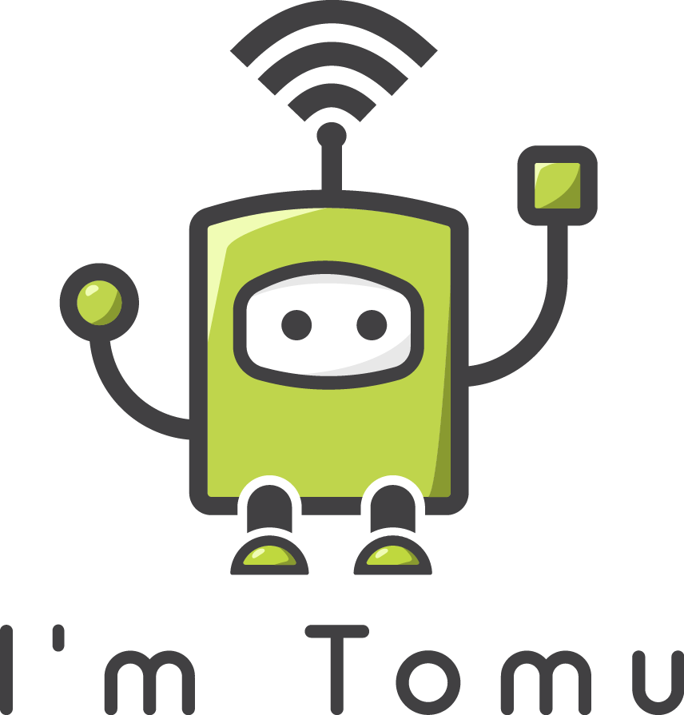

# [I'm Tomu!](https://tomu.im)

## Basic Tomu

The top level directory contains the basic green Tomu character and the
logoized version.

### [Colors](colors)

These are different color versions of the Tomu character.

### [OHSPark](ohs-park)

This is a version of the logos colors in [OHSPark](https://ohspark.com)
purple.

# Variants

## [Bluetooth](bluetooth)

This is a version of the logo intended for a Bluetooth version of the Tomu
board which would probably be called the "Tomu-B".

## [FPGA](fpga)

This is a version of the logo intended for a FPGA version of the Tomu
board which would probably be called the "Tomu-F".

## [NFC / Wireless](wireless).

This is a version of the logo intended for a NFC and/or wireless version of the
Tomu board which would probably be called the "Tomu-W".

# Font

The font used in the Tomu logo is
[Arciform by Ellis Design](https://www.behance.net/gallery/30453085/Arciform-Free-Typeface).

# Author

These awesome logo's were created by Azhan Malik <vecpik@gmail.com>.

If you want to contact him to create your own logo, you can find him on;
 * [Facebook](https://www.faceboob.com/vecpik)
 * [YouTube](https://www.youtube.com/channel/UCLS8n3LHG5FNlQrIsNKdCgA)
 * [Freelancer](https://www.freelancer.com/u/azhanmalik360)

They were created as part of a Freelancer Logo contest and copyright is
owned by Tim 'mithro' Ansell <me@mith.ro>.

# License

While these logos are available under CC-BY-SA 4.0, they are unregistered
trademarks of the Tomu project.  Please read our Trademark policy for how you
are allow to use them.

## Trademarks

[Our policy](https://tomu.im/trademarks) is taken directly from the Mozilla
foundation's trademark policy and we believe it is consistent with our open
source philosophy.

Although our code is free, it is very important that we strictly enforce our
trademark rights, in order to be able to protect our users against people who
use the marks to commit fraud.

Our trademarks include, among others, the names Tomu, the phrase "I'm Tomu", as
well as the Tomu logo, and the Tomu robot (including variants). This means
that, while you have considerable freedom to redistribute and modify our
software, there are tight restrictions on your ability to use the Tomu names
and logos in ways which fall in the domain of trademark law.

For more detail on our trademark licensing, see our Trademark Policy. If you
still have questions after reading the policy, please contact
[trademarks@tomu.im](mailto:trademarks@tomu.im).
